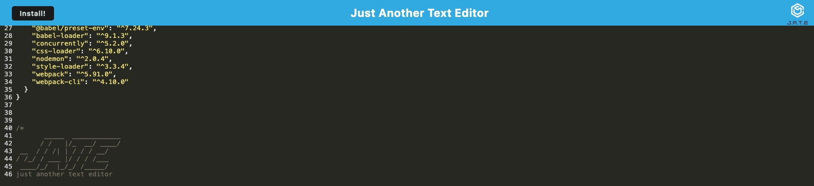

# Progressive Web Applications (PWA) Challenge: Text Editor

This text editor is a sophisticated, browser-based application designed to offer a seamless and efficient editing experience, even offline. Built as a Progressive Web Application (PWA), it leverages modern web technologies to provide features like data persistence through IndexedDB, offline capabilities, and an intuitive user interface for creating notes or code snippets.

## Table of Contents

- [Features](#features)
- [Installation](#installation)
- [Usage](#usage)
- [Technologies Used](#technologies-used)
- [Security](#security)
- [Contributing](#contributing)
- [License](#license)
- [Image](#Image)
- [Contact](#contact)

## Features

- **Offline Functionality**: Edit and save your notes or code snippets without an internet connection.
- **Data Persistence**: Utilizes IndexedDB for local data storage, ensuring your data is saved across sessions.
- **PWA**: Installable on desktop and mobile devices for quick access.
- **Modern JavaScript and Webpack**: Bundled using webpack and supports next-gen JavaScript features.

## Installation

Follow these steps to set up the project locally:

1. **Clone the repository**:
   ```bash
   git clone https://github.com/maslla100/customTextEditor
   ```
2. **Navigate to the project directory**:
   ```bash
   cd customTextEditor
   ```
3. **Install dependencies** (ensure you have Node.js installed):
   ```bash
   npm install
   ```
4. **Build the client application**:
   ```bash
   npm run build
   ```
5. **Start the server**:
   ```bash
   npm run start
   ```

## Usage

After installation, access the application through `http://localhost:3000` (or edit the port number at will) in your browser to start editing. The text editor saves your content automatically to IndexedDB when you switch focus away from the page, ensuring data persistence.

## Technologies Used

- **Node.js and Express.js** for the server-side logic.
- **Webpack** for bundling JavaScript files.
- **IndexedDB** with `idb` for data persistence.
- **Workbox** for PWA service worker and offline functionality.
- **Babel** for using next-gen JavaScript.

## Security

The application ensures security by using best practices such as HTTPS for service worker registration and secure handling of data with IndexedDB.

## Contributing

Contributions are welcome! Please follow these steps:

1. Fork the repository.
2. Create a feature branch: `git checkout -b new-feature`
3. Commit your changes: `git commit -am 'Add some feature'`
4. Push to the branch: `git push origin new-feature`
5. Submit a pull request.

## License

This project is open source and available under the [MIT License](LICENSE).

## Image



## Contact

Luis Llamas - Luis.Llamas@Maslla.com

Project Link: [https://github.com/maslla100/customTextEditor](https://github.com/maslla100/customTextEditor)

Application will be temporarily hosted for demonstration purposes on Render:  [https://customtexteditor.onrender.com]

